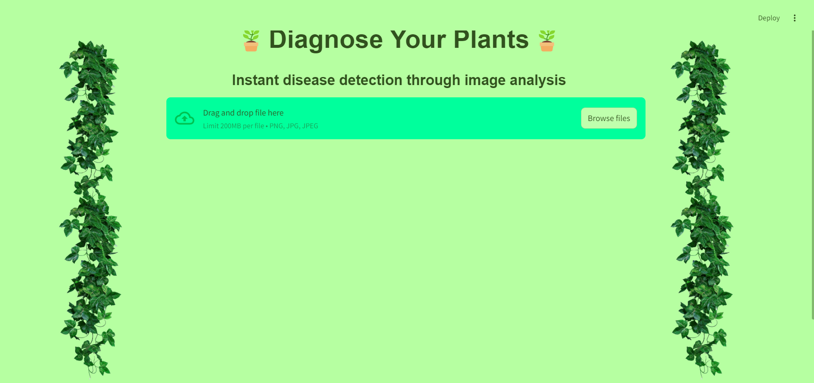
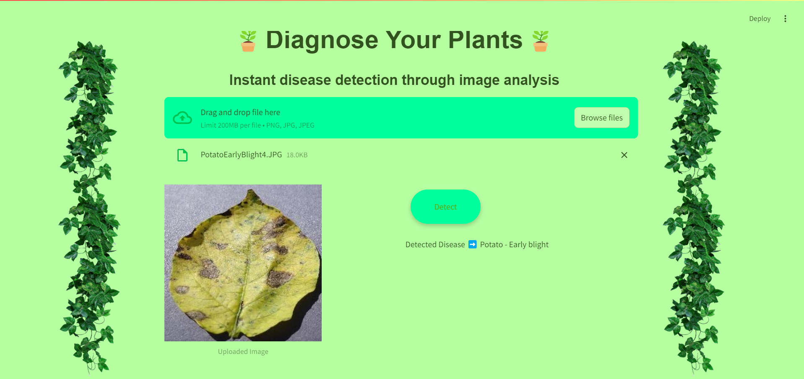

# Plant Disease Detection from Images

## Objective
The goal of this project is to develop a Streamlit application that enables users to upload images of plant leaves and accurately predict the presence and type of plant diseases using a Convolutional Neural Network (CNN) model.

## Project Scope
- **End-to-End Development:** This project encompasses all components, including data preprocessing, CNN training, and the development of a functional application.
- **Real-World Relevance:** This tool provides farmers and gardeners with a quick diagnosis of plant diseases, enhancing their ability to manage plant health effectively.

## Key Components

### 1. Image Preprocessing
- **Data Preparation:** Preprocessing steps such as resizing and normalization were implemented to prepare images for model training.
- **Dataset:** The New Plant Diseases Dataset from Kaggle was utilized, providing a comprehensive set of images.

### 2. Disease Classification
- **CNN Model:** A custom CNN architecture was defined and trained for 30 epochs, achieving satisfactory evaluation scores.
- **Transfer Learning:** Pretrained models (ResNet50, EfficientNetB0, DenseNet121) were evaluated without modifications, followed by the application of transfer learning by freezing layers and retraining the last layer to enhance performance.

### 3. Performance and Optimization
- **Model Evaluation:** Performance was assessed using accuracy, precision, and recall metrics to ensure robustness.
- **Optimization:** Efforts were made to minimize latency for real-time predictions.

### 4. User Interface Development
- **Streamlit Application:** A user-friendly web interface was developed using Streamlit, allowing users to upload images of plant leaves and receive disease predictions instantly.
- **Usability:** An intuitive experience was designed with clear instructions and feedback throughout the application.

### 5. Testing
- **Testing:** The application was rigorously tested for prediction accuracy and robustness with various image inputs.

## Expected Results
- **Functional Application:** A user-friendly Streamlit web application for effective plant disease detection was created.
- **Model Performance Report:** Detailed evaluation of the CNN model’s performance metrics was documented.
- **User Guide:** Documentation was prepared to assist users in setting up and using the application effectively.

## Tools and Technologies
- **Programming Language:** Python
- **Frameworks and Libraries:** Streamlit, PyTorch, Sklearn, OpenCV, Matplotlib
- **Dataset:** New Plant Diseases Dataset from Kaggle

## Deliverables
1. Streamlit Application
2. Well-documented Python codebase
3. Trained CNN models
4. Comprehensive project report
5. User guide for application setup and usage

## Screenshots of the application

## Model Performance Report

## User Guide
