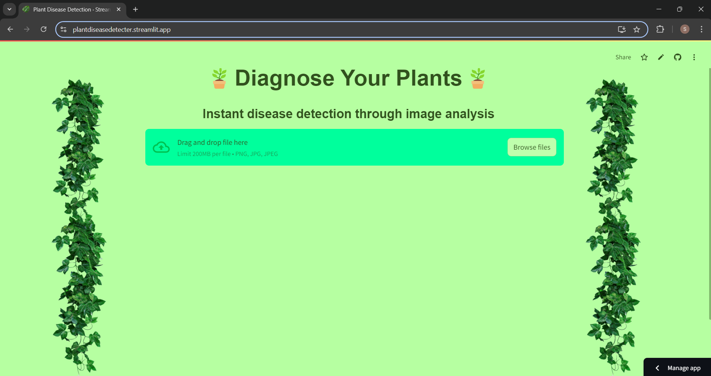
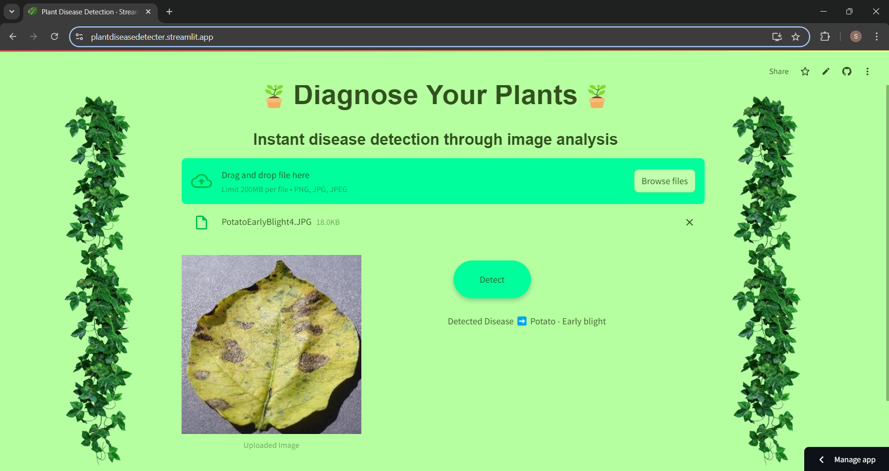
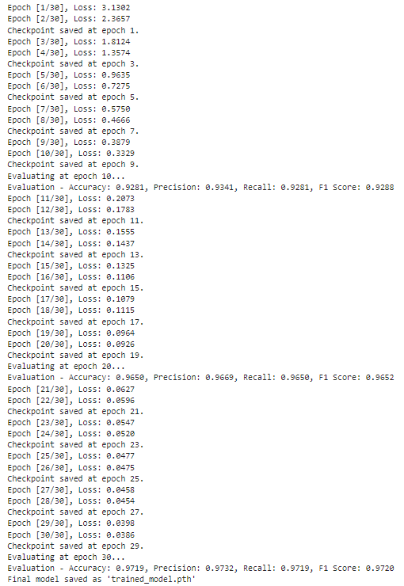
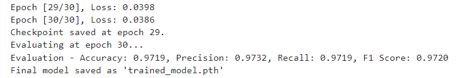
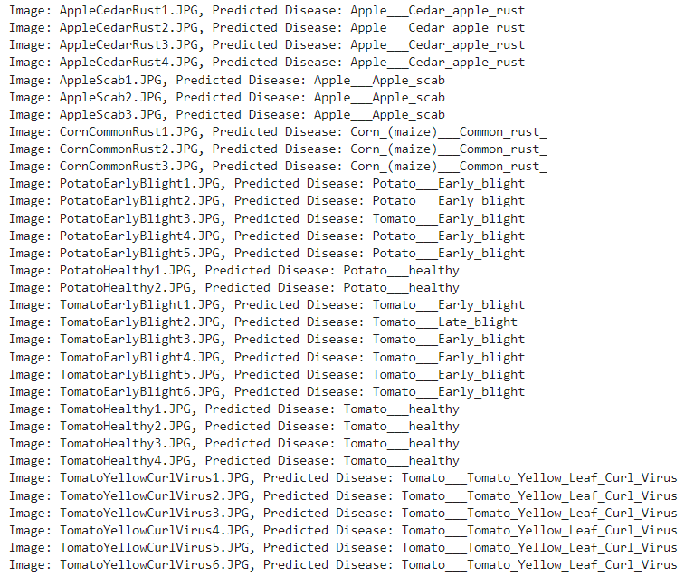
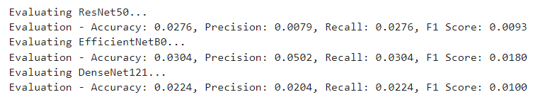
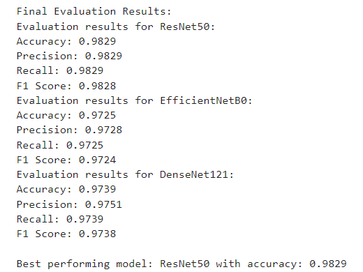
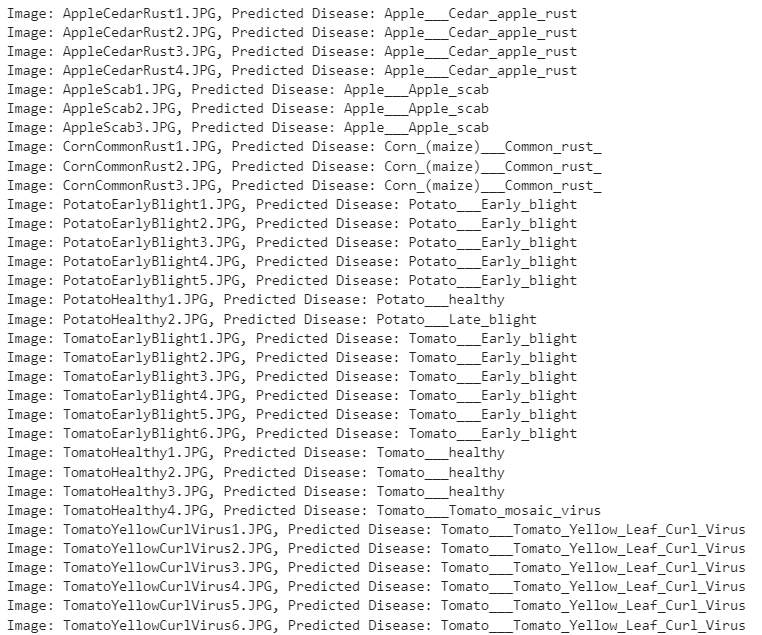

# Plant Disease Detection from Images

## Objective
The goal of this project is to develop a Streamlit application that enables users to upload images of plant leaves and accurately predict the presence and type of plant diseases using a Convolutional Neural Network (CNN) model.

## Project Scope
- **End-to-End Development:** This project encompasses all components, including data preprocessing, CNN training, and the development of a functional application.
- **Real-World Relevance:** This tool provides farmers and gardeners with a quick diagnosis of plant diseases, enhancing their ability to manage plant health effectively.

## Key Components

### 1. Image Preprocessing
- **Data Preparation:** Preprocessing steps such as resizing and normalization were implemented to prepare images for model training.
- **Dataset:** The New Plant Diseases Dataset from Kaggle was utilized, providing a comprehensive set of images.

### 2. Disease Classification
- **CNN Model:** A custom CNN architecture was defined and trained for 30 epochs, achieving satisfactory evaluation scores.
- **Transfer Learning:** Pretrained models (ResNet50, EfficientNetB0, DenseNet121) were evaluated without modifications, followed by the application of transfer learning by freezing layers and retraining the last layer to enhance performance.

### 3. Performance and Optimization
- **Model Evaluation:** Performance was assessed using accuracy, precision, and recall metrics to ensure robustness.
- **Optimization:** Efforts were made to minimize latency for real-time predictions.

### 4. User Interface Development
- **Streamlit Application:** A user-friendly web interface was developed using Streamlit, allowing users to upload images of plant leaves and receive disease predictions instantly.
- **Usability:** An intuitive experience was designed with clear instructions and feedback throughout the application.

### 5. Deployment and Testing
- **Deployment:** The application is deployed on Streamlit Cloud, providing users with easy access to upload images of plant leaves and receive disease predictions instantly. 
- **Testing:** The application was rigorously tested for prediction accuracy and robustness with various image inputs.

## Expected Results
- **Functional Application:** A user-friendly Streamlit web application for effective plant disease detection was built and deployed.
- **Model Performance Report:** Detailed evaluation of the CNN model’s performance metrics was documented.
- **User Guide:** Documentation was prepared to assist users in setting up and using the application effectively.

## Tools and Technologies
- **Programming Language:** Python
- **Frameworks and Libraries:** Streamlit, PyTorch, Sklearn, OpenCV, Matplotlib
- **Dataset:** New Plant Diseases Dataset from Kaggle

## Deliverables
1. Streamlit Application
2. Well-documented Python codebase
3. Trained CNN models
4. Comprehensive project report
5. User guide for application setup and usage

## Screenshots of the application






## Model Performance Report

#### Custom model-ImprovedCNN loss and evaluation scores :-



#### Custom model testing results with some new test images :-


#### Pre trained models evaluation scores before using Transfer Learning:-


#### Pre trained models evaluation scores After using Transfer Learning:-


#### ResNet50 Model is best performing model out of the three pretrained models. And the test results with some new test images are:-


### We can observe that though the evaluation scores for ResNet50 model compared to the ImprovedCNN model are slightly better, the predictions on new test images were more accurate with our custom ImprovedCNN model. Hence, I have used custom ImprovedCNN model in the streamlit app for disease detection. 

## User Guide

This project uses deep learning to detect plant diseases based on leaf images. Follow the steps below to set up, run, and use the app.

### 📂 Dataset

1. **Download the Dataset**  
   - Get the plant disease dataset from [Kaggle](https://www.kaggle.com/datasets/vipoooool/new-plant-diseases-dataset).
   - Extract the zip file after downloading.
   - This dataset consists of 38 classes(diseases or healthy state)

### 💾 Pre-Trained Model Checkpoint

1. **Download the Saved Model**  
   - Download the model weights from [Google Drive](https://drive.google.com/drive/folders/1aV1jon0PozYPncxlGzSo71PAegrDk0EI)
   - Place the downloaded files in a folder named `saved_models` in the project’s root directory.
   - The saved model that i used in the app is named as "trained_model.pth"

### ⚙️ Installation

1. **Install Requirements**  
   - Navigate to the project’s root directory and install the required dependencies:
     ```bash
     pip install -r requirements.txt
     ```

### 🚀 Running the App

1. **Start the Streamlit App**  
   - Open a terminal, go to the `streamlit_app` folder, and run:
     ```bash
     cd path/to/your/project/streamlit_app
     streamlit run app.py
     ```

### 📘 Usage

1. **Upload an Image**: Upload a leaf image in `.jpg`, `.jpeg`, or `.png` format.
2. **Detect Disease**: Click **Detect** to analyze the image and get a diagnosis.

---

Happy diagnosing! 🌿
